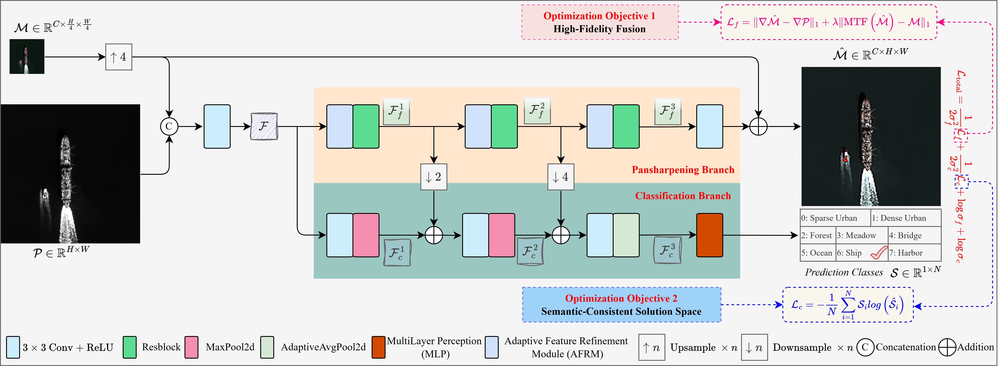

# CSSL

This is a PyTorch Lightning implementation of **CSSL: High-Fidelity Pansharpening via Compressed Solution Space Learning**.

## Architecture



## Paper

This repository is associated with the following accepted TGRS paper:

```bibtex
@article{xu2026cssl,
  title={CSSL: High-Fidelity Pansharpening via Compressed Solution Space Learning},
  author={Xu, Biyun and Zheng, Yan and Mazhar, Suleman and Xu, Chenglong and Huang, Zhenghua and Li, Yansheng},
  journal={IEEE Transactions on Geoscience and Remote Sensing},
  year={2026},
  volume={64},
  number={},
  pages={5406916-5406916},
  doi={10.1109/TGRS.2026.3716957}
}
```

Paper link: [https://doi.org/10.1109/TGRS.2026.3716957](https://doi.org/10.1109/TGRS.2026.3716957)

## Structure

```text
CSSL/
  network/          # CSSL model and Wald/MTF utilities
  dataset/          # PSC-style dataset loader
  src/              # metrics, plotting, and image utilities
  train.py          # training entry point
  inference.py      # inference entry point
```

The public model API is:

```python
from network import CSSL

model = CSSL(ms_channels=8, num_classes=8, task=True, sensor="worldview-2")
```

## Installation

```bash
pip install -r requirements.txt
```

Install the PyTorch build that matches your CUDA environment from the official PyTorch instructions if needed.

## Dataset

Experiments in the paper are conducted on the proposed PSC benchmark, which is constructed from the NBU dataset with additional scene category labels.

PSC dataset download:
- File: `PSC.zip`
- Link: [Baidu Netdisk](https://pan.baidu.com/s/1ZiztyWrPlmqvwGgvHDELtg)
- Extraction code: `0624`

The expected layout is:

```text
data/psc/<sensor>/
  Train/
    MS/*.mat
    PAN/*.mat
    label/*.txt
  val/
    MS/*.mat
    PAN/*.mat
    label/*.txt
  Test/
    FR/
      MS/*.mat
      PAN/*.mat
    RR/
      MS/*.mat
      PAN/*.mat
```

Each MS `.mat` file should contain key `MS`, and each PAN `.mat` file should contain key `PAN`. Label files store one integer class id per sample.

Users may prepare the PSC data following the benchmark construction and parameter settings described in the paper.

## Training

```bash
python train.py --data-dir data/psc --sensor worldview-2
```

Default training settings follow the paper: 600 epochs, batch size 16, Adam optimizer, initial learning rate 1e-3, and a decay factor of 0.8 every 50 epochs.
The best checkpoint is selected by the minimum validation loss.

Useful options:

```bash
python train.py \
  --sensor worldview-2 \
  --checkpoint-dir checkpoints \
  --batch-size 16 \
  --epochs 600 \
  --lr 1e-3 \
  --task
```

## Inference

```bash
python inference.py \
  --data-dir data/psc \
  --sensor worldview-2 \
  --checkpoint checkpoints/CSSL-worldview-2.ckpt \
  --save-dir outputs \
  --fr-test true
```

The output includes `.mat` files with key `hrms_image` and RGB preview images.

## Acknowledgement

The PSC benchmark is built from the NBU dataset with additional scene labels. If you use this code or dataset preparation protocol, please cite the CSSL paper and the original NBU dataset source.

```bibtex
@article{meng2021nbu,
  title={A Large-Scale Benchmark Data Set for Evaluating Pansharpening Performance: Overview and Implementation},
  author={Meng, Xiangchao and Xiong, Yiming and Shao, Feng and Shen, Huanfeng and Sun, Weiwei and Yang, Gang and Yuan, Qiangqiang and Fu, Randi and Zhang, Hongyan},
  journal={IEEE Geoscience and Remote Sensing Magazine},
  year={2021},
  volume={9},
  number={1},
  pages={18--52},
  doi={10.1109/MGRS.2020.2976696}
}
```

If you find this repository useful, please consider giving it a 🌟.
